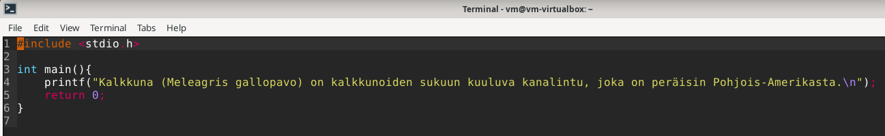
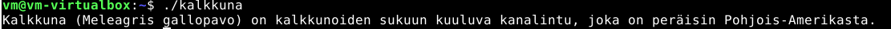
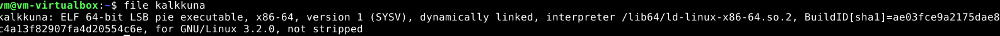

# H0
## Ohjelman kääntäminen binääriksi

Luon uuden c-ohjelman, joka kertoo, mikä kalkkuna on.

Käännän ohjelman binääriksi käyttäen `gcc`-komentoa ja nimeän samalla ohjelman kalkkunaksi  `-o kalkkuna`, muuten se saa oletusnimeksi a.out

Testataan ohjelmaa 

## Binäärin analysointi

Tarkastelen käännetyn ohjelman ominaisuuksia `file`-komennolla

Kuvakaappauksesta näkyy esimerkiksi tiedostotyyppi, bitti arkkitehtuuri ja minkälaisen linux-ytimen ohjelma vaatii toimiakseen

## Lähteet
Tehtävän teossa on käytetty gemini-tekoälyä apuna.
Käytetyt kehotteet: compiling c program, file-command breakdown

tehtävänannot: https://terokarvinen.com/application-hacking/

wikipedia kalkkunoista https://fi.wikipedia.org/wiki/Kalkkuna
