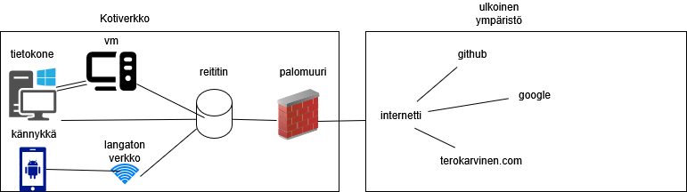

# h1 ISMS
ISMS laajuus tälle tehtävälle on oma kotiverkkoni
## Mitkä asiat sisältyvät ISMS:n laajuuteen
### kotiympäristön infrastruktuuri
  - reititin
  - langaton verkko
  - verkkokaapelit

### laitteet
  - tietokone
  - kännykkä
  - VM (virtualbox)
### tiedot ja data
  - kurssimateriaalit
  - githubin tiedostot
  - käyttäjätunnukset
## Mitkä asiat eivät kuulu tämän ISMS:n laajuuten
  - laitteet, jotka eivät kuulu minulle (omistajuus)
  - verkkotarjoajan internetti ja sen infrastruktuuri (omistajuus)
## Liittymät ja rajapinnat
  - Github
  - internetti
  - palomuuri

## Mitä todisteita voin esittää?

github
  - käyttäjätiedot

vm
  - lista käytössä olevista virtuaalikoneista ja niiden ominaisuuksista

laitteet
  - lista käytössä olevista laitteista (kännykät, tietokoneet) ja milloin niitä on käytetty

infrastuktuuri
  - lista infrastuktuurista (reititin ja langaton verkko) ja niiden asetuksista

# Tehtävän yhdistäminen standardiin

Sidosryhmät, jotka liittyisivät tähän tehtävään: minä ja github (pilvipalvelun tarjoaja)

### tarpeet ja vaatimukset

minä
  - kurssitehtävien teko ja tiedon säilytys

github
  - tiedon turvaaminen, kaksivaiheinen sisäänkirjautuminen ja käyttöehtojen noudattaminen

### asiat, jotka sisältyvät ISO 27001:2023 vaatimuksiin

minä 
  - johtajuus, suunnittelu ja toiminta

github
  - toiminta ja tukitoiminnot

### todiste vaatimusten täytöstä

minä

  - turvallisuustoimien suunnitelu, käyttöönotto ja dokumentointi (vahvat salasanat, palomuurin asetukset ja varmuuskopiot)

github
  - kaksivaiheisen sisäänkirjautumisen käyttöönotto

## Lähteet

kurssinmateriaalit: https://terokarvinen.com/application-hacking/ ja moodlesta ISO 27001 standardi

google: suomennos ja termit

draw.io käytetty taulukon teossa
