# H2 Break and unbreak
## x) yhteenveto
### OWASP Top 10: A01 Broken Access Control
  * puutteellinen pääsynvalvonta voi johtaa tilanteisiin, jossa käyttäjä voi päästä käsiksi tietoihin, joihin hänellä ei ole lupaa.
  * pääsynvalvonnan ohittaminen voidaan tehdä muokkaamalla URL-osoitetta, HTML-sivua tai käyttämällä API-kutsuja muokkaavaa hyökkäystyökalua.
  * Ehkäisytapoja ovat mm. pääsyn esto oletusarvoisesti,pääsynvalvontamekanismin toteutus, lokien kirjaaminen, istuntotodisteen mitätöinti uloskirjautumisen jälken, API-pyyntöjen maksimi pyyntömäärän asettaminen.
### Karvinen 2023: Find Hidden Web Directories - Fuzz URLs with ffuf
  * ffuf on joohoi:n kehittämä web fuzzer, jota voidaan käyttää esimerkiksi etsimään verkkopalvelimesta piilotettuja hakemistoja syöttämällä URL:iin eri polkuja.
  * ffuf tarvitsee sanalistan, josta se syöttää verkkopalvelimeen eri polkuja. Sanalistoja voidaan luoda itse tai käyttämällä valmiiksi luotuja esim. SecLists.
### PortSwigger: Access control vulnerabilities and privilege escalation
  * vertical access control: valvoo käyttäjän sallittuja toimintoja. Puuttelisessa pääsynvalvonnassa käyttäjä voi esim. saada ylläpitäjän oikeuksia
  * horizontal access control: valvoo käyttäjän pääsyä tietoihin. Puuttelisessa pääsynvalvonnassa käyttäjä voi esim. hallinnoida toisen käyttäjän tietoja.
  * context-dependent access controls: valvoo käyttäjän toimintoja ja pääsyä tietoihin tilannekohtaisesti. Puuttelisessa pääsynvalvonnassa käyttäjä voi esim. muokata tilauspyyntöä maksun jälkeen.

## a) Karvinen 2024: Hack'n Fix 010-staff-only-tehtävä

Tehtävässä käytän VirtualBox virtuaalikonetta, jossa on Debian 13-käyttöjärjestelmä ja firefox-selain

Lataan ja puran tehtävät komentokehotteessa:
```
$ wget https://terokarvinen.com/hack-n-fix/teros-challenges.zip
$ unzip teros-challenges.zip
```
Suoritan staff only-ohjelman ja saan huomion puuttuvasta paketista
```
$ cd challenges/010-staff-only/
$ python3 staff-only.py
from flask import Flask, render_template, request # sudo apt-get install python3-flask
ModuleNotFoundError: No module named 'flask'
```
Lataan puuttuvan ja suoritan ohjelman uudelleen
```
$ sudo apt-get -y install python3-flask python3-flask-sqlalchemy

$ python3 staff-only.py
WARNING: Purposefully VULNERABLE APP!
 * Serving Flask app 'staff-only'
 * Debug mode: off
WARNING: This is a development server. Do not use it in a production deployment. Use a production WSGI server instead.
 * Running on http://127.0.0.1:5000
Press CTRL+C to quit
```
Menen selaimessa osoitteeseen http://127.0.0.1:5000

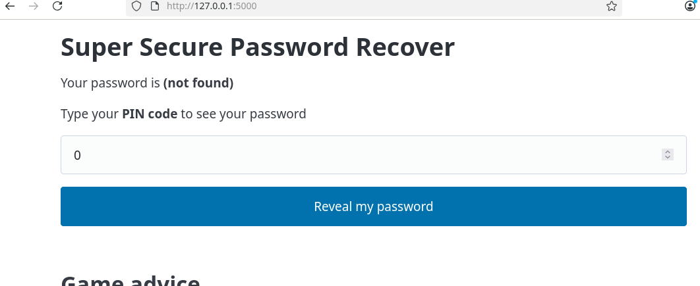

Tehtävänä on selvittää ylläpitäjän salasana verkkopalvelimesta.

Sivusta nähdään, että SELECT on password ja WHERE on pin='0' ja PIN-koodi on 123

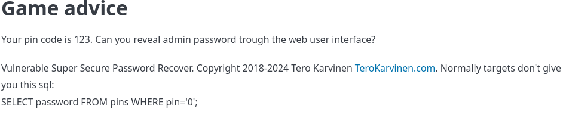

Kokeilen ensiksi syöttämällä PIN-koodi 123 ja saan vastaukseksi ```your password is somedude```

Seuraavaksi teen perus SQL-injektion syöttämällä URL:iin tosi-ehdon pin-kategoriaan:
```
http://127.0.0.1:5000/filter?pin='+or+1=1--
````
Valitettavasti sivu kaatuu.

Seuraavaksi koitan tehdä saman syöttämällä PIN code-palkkiin:
```
'+or+1=1--
```
Huomaan, että sivu hyväksyy vain numeroita, joten avaan firefoxin inspectorin ```F12 ```-näppäimellä

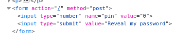

Sieltä näen, että input type on ```number```, joten muutan sen ```text```

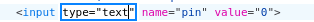

Kokeilen uudestaan syöttää PIN code-palkkiin '+or+1=1--, mutta sivu kaatuu. Eri syöttöjen ja Googlailun jälkeen, kokeilen samaa SQL injektiota tapaa, mutta ilman ```+```-merkkejä eli pelkästään ``` ' or 1=1--``` 

Vihdoinkin se toimi ja sain vastaukseksi ```password is foo``` 

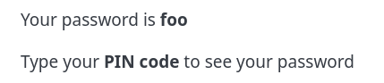

Tämän jälkeen jumituin aika pitkään ja kokeilin eri SQL injektio tapoja ja onnistuin löytämään admin salasanan käyttämällä ```' union select password from pins--```, koska tehtävässä on mainittu valmiiksi SELECT ja WHERE-arvot ei tarvinnut erikseen etsiä niitä. Ainoastaan piti päätellä pitääkö password tai pin olla monikossa tai yksikössä, koska ```union select password from pin--``` tai ```' union select passwords from pin--``` eivät toimineet

```union ``` mahdollistaa useiden kyselyiden yhdistämisen, koska tietokantaa huijataan tekemään eri kyselyitä tyhjällä pin code syötteellä, tietokanta palauttaa ```pins```-taulukosta  ensimmäisen salasanan ```password```-sarakkeesta. Ensimmäinen salasana on yleensä pääkäyttäjän.

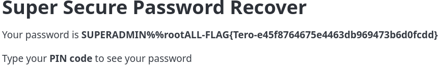

## b) Fix

Pitkän pähkäilyn jälkeen en kyllä osaa korjata haavuttuvuuden lähdekoodista  010-staff-only.py 

## c) dirfuzt-1

Tehtävässä käytän VirtualBox virtuaalikonetta, jossa on Debian 13-käyttöjärjestelmä ja firefox-selain

Lataan ensin tehtävän,annan oikeudet,suoritan sen komentokehotteessa ja käyn verkko selaimessa osoitteeseen http://127.0.0.2:8000

```

$ wget https://terokarvinen.com/2023/fuzz-urls-find-hidden-directories/dirfuzt-1
$ chmod u+x dirfuzt-1
$ ./dirfuzt-1

```


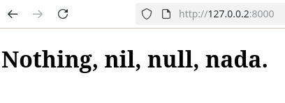

Tehtävänä on löytää sivusta seuraavat piilotetut hakemistot: admin page ja version control related page, joten käytän apuna ffuf:ia ja siihen SecList:in sanalistaa.

Lataan ensin ffuf ja sen jälkeen Seclist
```
sudo apt-get install ffuf -y
```
```
wget https://raw.githubusercontent.com/danielmiessler/SecLists/master/Discovery/Web-Content/common.txt
```
Suoritan komennon ``` ffuf -w common.txt .u http://127.0.0.2:8000/FUZZ ```. Huomaan, että suurin osa ovat kokoa 154, joten rajaan hakua lisäämällä ```-fs 154```, tällöin jää 7 käytettävää polkua


Tästä löydän haettavat hakemistot: admin ja .git

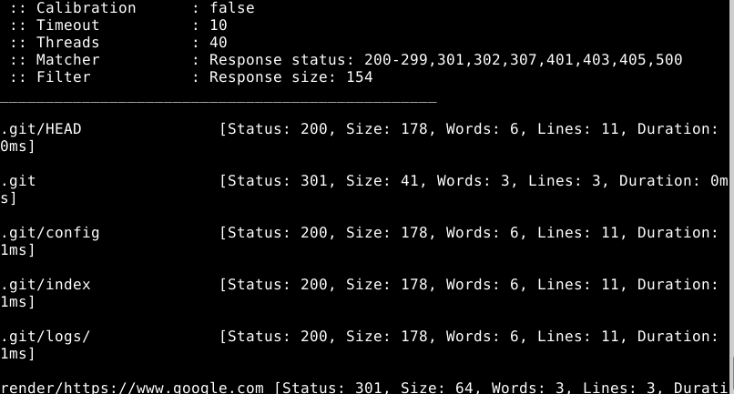

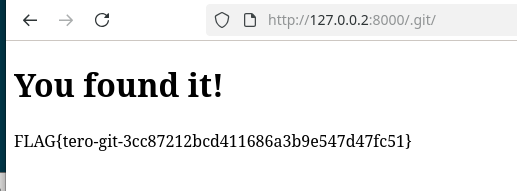

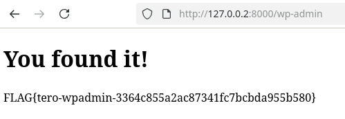

Tehtävän aikana ilmenneet ongelmat: ./ffuf suorittaminen palautti ```no file or directory```. Yritin ladata ffuf-ohjelman uudelleen muutaman kerran ja ratkaisu löytyi jättämällä pois ./ aloitteen.

## d) 020-your-eyes-only

Tehtävänä on löytää adminsitrative console

Siirryn 020-your eyes only- kansioon ```cd challenges/020-your-eyes-only/```ja lataan virtuaalisen ympäristön 
```sudo apt-get -y install virtualenv```
```virtualenv virtualenv/ -p python3 --system-site-packages```

Käynnistän virtualenv

```source virtualenv/bin/activate```

```pip install -r requirements.txt``` 

```pip install -r requirements.txt```

Menen kansioon, josta löytyy manage.py ja päivitän tietokannan
```
cd logtin/

/manage.py makemigrations; ./manage.py migrate
```
Käynnistän palvelimen, jonka osoite on http://127.0.0.1:8000/

```
./manage.py runserver
```


Samoin kuin edellisessä tehtävässä, käytän fuff:ia ja SecList:in sanalistaa. 

```
ffuf -w common.txt -u http://127.0.0.1:8000/FUZZ
```

Tästä tulee iso määrä vastauksia, joilla on samat HTTP status koodi: 404, joten lisään entiseen komentoon status code suodatuksen ```-fc 404 ```

```
ffuf -w common.txt -u http://127.0.0.1:8000/FUZZ -fc 404
```
Saan vastaukseksi yhden toimivan polun, joka on admin-console.

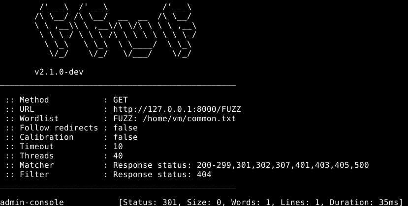

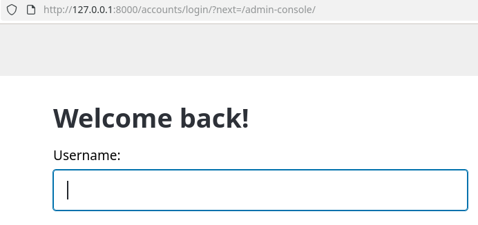

Seuraavaksi käytän ffuf:ia käymään läpi salasanoja ja käyttäjänimiä. Opin Helsec fluff videosta, että voidaan käyttää useampia sanalistoja ja ne voidaan referoida haluamiin kenttiin.

Lataan ensin SecList:istä tarvittavat sanalistat

```
wget https://raw.githubusercontent.com/danielmiessler/SecLists/master/Usernames/Names/names.txt

wget https://raw.githubusercontent.com/danielmiessler/SecLists/master/Passwords/Common-Credentials/darkweb2017_top-1000.txt
```
*varmaan järkevämpi käyttää pienempiä sanalistoja, sillä noista kahdesta tuli noin miljoona vastausta

Käytän komentoa ```ffuf -w names.txt:USER -w darkweb2017_top-100.txt:PASS -d 'id_username=USER&id_password=PASS' -u http://127.0.0.1:8000/accounts/login/?next=/admin-console/FUZZ -fc 403```

```'id_username=USER&id_password=PASS'``` kertoo mihin kenttiin halutaan referoida, tässä referoin verkkosivun käyttäjä ja salasana kenttiin (id_username ja id_password).

``` -fc 403 ``` suodattaa http 403 vastaukset

Valitettavasti en löytänyt vastauksia, jossa ei olisi HTTP 403.


### Lähteet
Tehtävänanto: Terokarvinen.com https://terokarvinen.com/application-hacking/

OWASP Top 10: A01 Broken Access Control https://owasp.org/Top10/2021/A01_2021-Broken_Access_Control/index.html

Karvinen 2023 Fuzz URLs with ffuf https://terokarvinen.com/2023/fuzz-urls-find-hidden-directories/

portswigger: Access control vulnerabilities and privilege escalation https://portswigger.net/web-security/access-control

portsqigger SQL injection https://portswigger.net/web-security/sql-injection

Karvinen 2024 Hack'n Fix https://terokarvinen.com/hack-n-fix/

googlea ja geminiä on käytetty materiaalin suomennoksessa ja selittämään enemmän SQL injektioista.

Helsec ffuf https://www.youtube.com/watch?v=mbmsT3AhwWU
