# h3 No Strings Attached 
Tehtävien teossa käytetty ympäristö:

Virtualisointi: VirtualBox

Käyttöjärjestelmä: Debian 13.4.0

Selain: firefox

Verkko: NAT

## a) passtr
Tehtävänä on ladata ezbin-challenges, ajaa passtr-ohjelma ja käyttää strings-komentoa löytämään siitä salasana/flagi

Lataan ezbin-challenges.zip tiedoston ja puran sen 
```
cd Downloads/
unzip ezbin.challenges.zip -d /home/vm/h3
```
avaan hakemiston ja suoritan passtr-ohjelman
```
cd /h3/challenges/passtr
./passtr
```
terminaali näyttää: "What's the password"

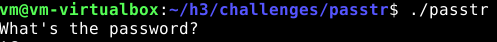

Käytän ```strings``` -komentoa, joka listaa tulostettavat merkit tiedostosta.

```
strings passtr
```

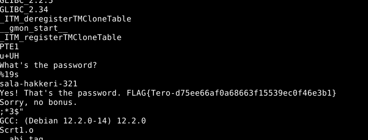

Tästä näen, että salasana on sala-hakkeri-321 ja flagi on FLAG{Tero-d75ee66af0a68663f15539ec0f46e3b1}

## b) fix passtr
Tehtävä on korjata haavoittuvuus siten, että salasanaa ei saataisi näkyviin enään strings-komennolla. 

Tehtävänannossa mainittiin, että obfuscation riittää, joten googlailun ja tekoälyltä kyselyn jälkeen päätin käyttää yurisk.info verkkosivun salaus tapaa, 
jossa määritetään käännösvaiheessa merkeille eri ASCII-arvot ja suorituksen aikana arvot palautetaan oletusarvoiksi

Tarkastelen lähdekoodia

```
micro passtr.c
```
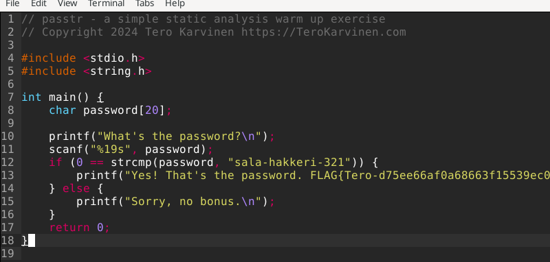

määritän makron arvot 
```
#define HIDE_LETTER(a) ((a) + 0x35)
//merkkien ASCII-arvojen muuttaminen käännösvaiheessa
#define UNHIDE_STRING(str)  do { char * ptr = str ; while (*ptr) *ptr++ -= 0x35; } while(0)
//merkkien ASCII-arvojen palauttaminen suorituksen aikana
```
määritän, että kaikki salasanan merkkien ASCII-arvot muuttuvat makrossa
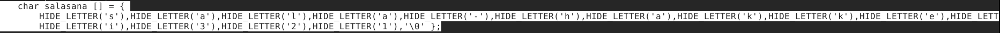

Suorituksen aikana salasana käännetään takaisin oletusarvoksi 

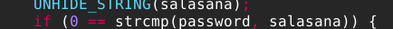

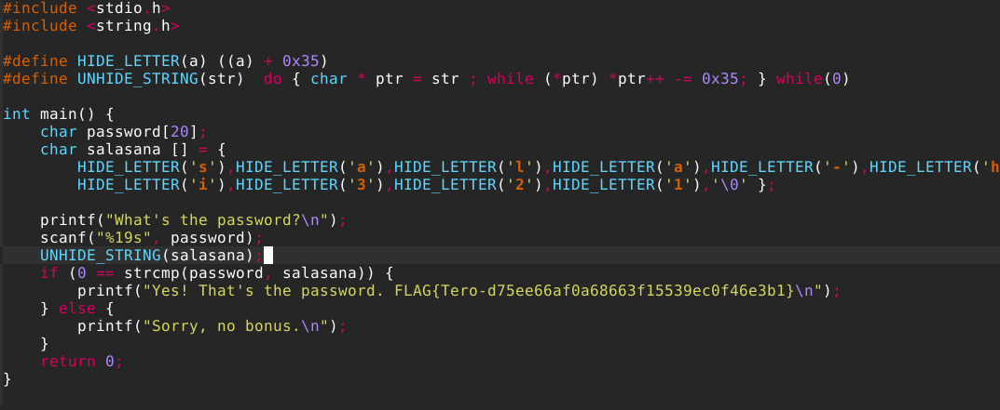

Kokeilen ```string``` -komennolla näkyykö salasana.
```
strings passtr
```
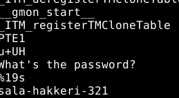

Valitettavasti salasana vielä näkyy ja enkä kyllä osaa edetä pidemmälle

Mietiskelyn jälkeen, tajusin, että unohdin käyttää gcc:tä uudessa koodissa ja olin suorittanut vanhaa passtr-ohjelmaa. Joten:
  ```
  gcc passtr.c -o passtr2
  strings passtr2
  ```
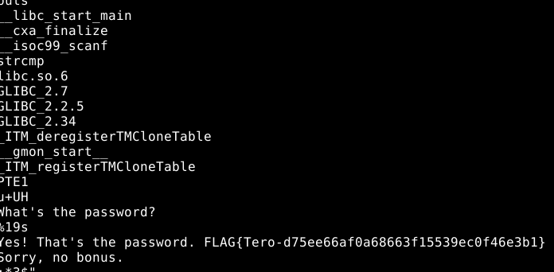

Nyt näyttää toimivan! Salasana ei suoraan näy ```strings```-komennossa

Teen saman salauksen flagille, mutta lyhennän flag-merkkijonoa oman laiskuuteni vuoksi

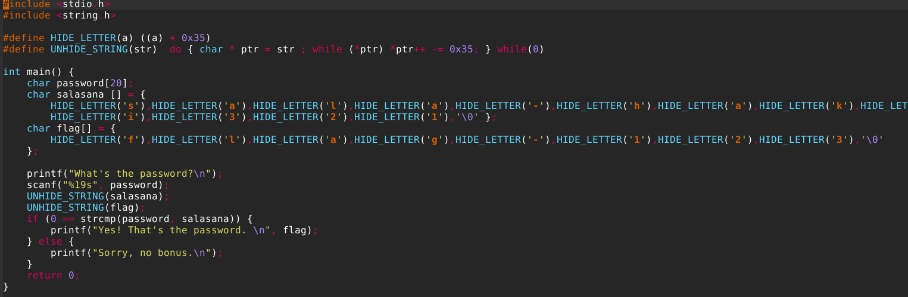

Katson ```string```-komennosta ja tarkistan vielä ajamalla ohjelmaa 

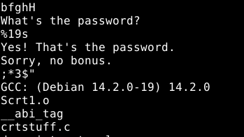

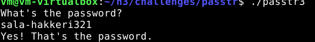

Kaikki näyttä toimivan paitsi flag ei tule esiin oikean salasanan yhteydessä.

Kysyin tekoälyltä apua virheen paikantamiseen ja näköjään puuttui paikanpitäjä merkkijonon tulostamista varten. (%s)


Kokeillaan

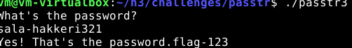

Ja toimii
## C) packd

Sama homma kuin tehtävässä A eli yritetään selvittää salasana ja flag

tarkastelen ```strings```-komennolla 

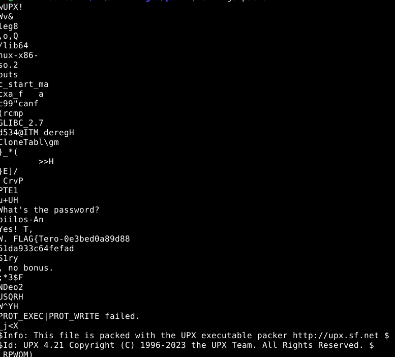

käytän gcc:tä

  ```
  gcc passtr.c -o passtr2
  strings passtr2
  ```

Huomaan, että saan vastaukseksi läjän merkkisalaattia, eivätkä salasana tai flag ole selvästi näkyvissä. Tosin silmään pisti seuraava kohta:

```
This file is packed with the UPX executable packer
```
Pikaisen googlauksen jälkeen tämä on komentorivityökalu, joka paketoi tai purkaa suoritettavia tiedostoja. Paketoinnin seurauksena merkkijonot salataan ja tiedosto saa UPX-otsikon (tässä tapauksessa otsikko on wUPX!).

Kokeilen ensin ladata upx työkalun ja purkaa tiedosto.
```
sudo apt install upx-ucl -y
```
```
upx -d /home/vm/h3/challenges/packd/packd
```
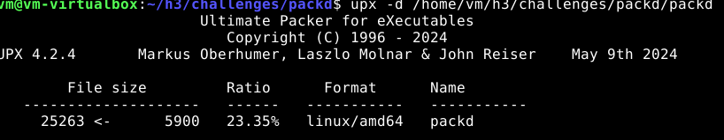

* ratio on vain 23.35% eli onko tiedosto vaan osittain purettu?
  
Seuraavaksi suoritan ```strings``` -komennon

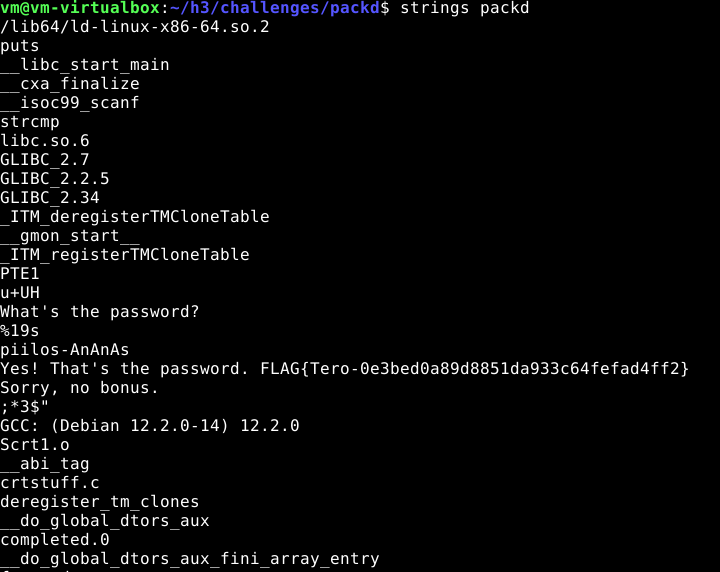


Nyt on selvästi enemmän luettavampaa tietoa. Salasana ja flag ovat selkeästi esillä.

Ihan tarkistuksen vuoksi kokeilen toimiiko salasana

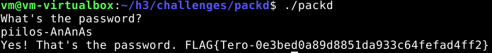


### Lähteet

Tehtävänannot: https://terokarvinen.com/application-hacking/

strings: https://www.howtogeek.com/427805/how-to-use-the-strings-command-on-linux/

obfuscation in c: https://yurisk.info/2017/06/25/binary-obfuscation-string-obfuscating-in-C/

google kehotteet: upx packer

tehtävän teossa on käytetty gemini tekoälyä tiedon haussa, suomennoksessa ja termien selittämisessä


