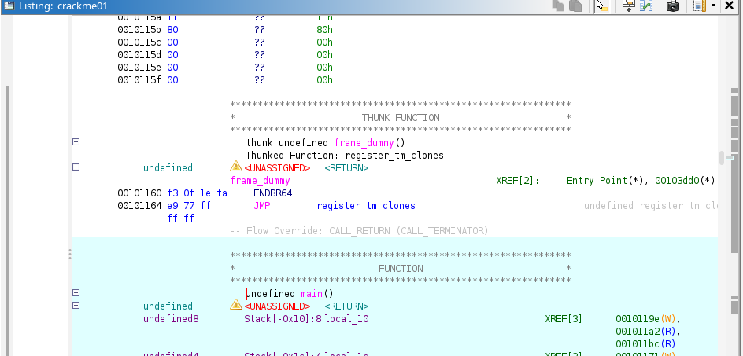
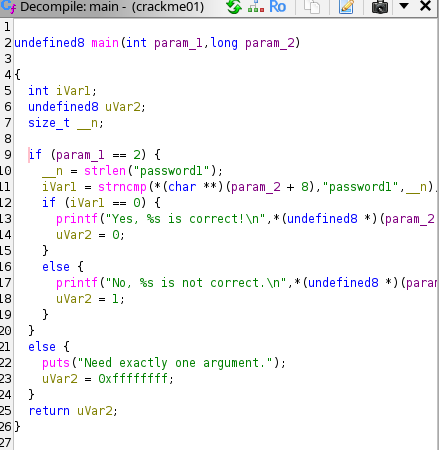
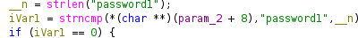
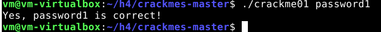
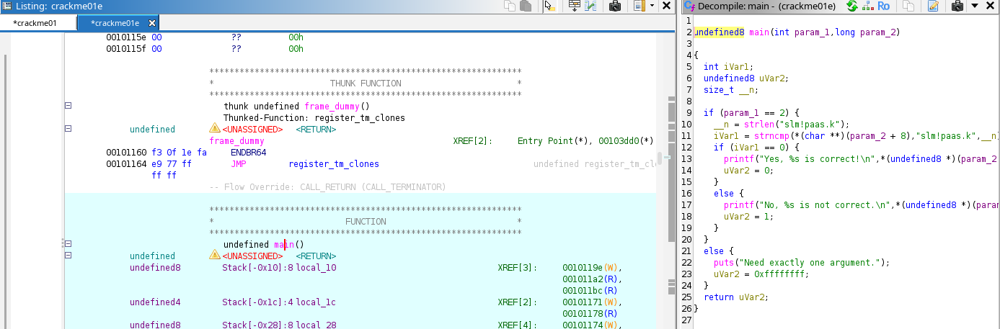
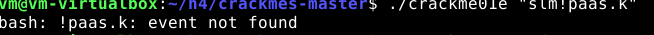
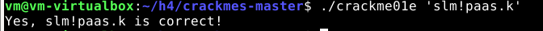
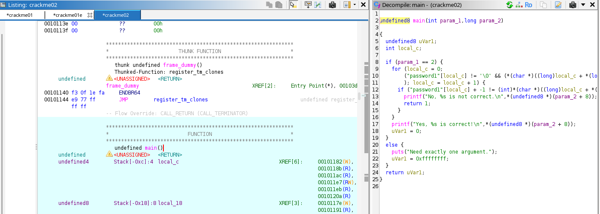

## H4 Some Disassembly Required

Tehtävien teossa käytetty ympäristö:

Virtualisointi: VirtualBox

Käyttöjärjestelmä: Debian 13.4.0

Selain: firefox

Verkko: NAT

### x) Yhteenveto

* Ghidra on open source reverse engineering-työkalu, jolla voidaan tutkia binääritiedostoja.
* Ghidra kääntää binääritiedoston luettavaksi C-kieleksi decompiler-työkalun avulla.
* Ghidrasta voidaan etsiä haluttuja merkkijonoja ja tutkia niitä käyttämällä Defined strings- työkalua.

### a) Install ghidra

Lataan JDK-25 ```sudo apt-get install openjdk-25-jdk```

Haen ghidra version 12.3.1 [githubista](https://github.com/NationalSecurityAgency/ghidra/releases)

Luon ghidra kansion, siirrän .zip tiedoston sinne ja puran sinne
```
mkdir ghidra
cd ghidra
mv ~/Downloads/ghidra_12.1.3_PUBLIC_20260817.zip .
unzip ghidra_12.1.3_PUBLIC_20260817.zip
cd ghidra_12.1.3_PUBLIC/
```
Käynnistän ghidran ```./ghidrarun```

### b) Reverse-C
Tehtävänä on kääntää packd-binääritiedosto C-kielelle käyttämällä ghidraa. Etsiä main-funktio ja vaihtaa muuttujien nimet sekä ratkaista tehtävä (löydä salasana ja flag)

Luon ghidrassa uuden projektin ja valitsen poluksi ```/home/vm/h3/challenges/packd```


Valitettavasti ohjelma ei jostakin syystä pystynyt avaamaan ja antoi tyhjää, joten  file > import file> packd


Ohjelma näytti heti main()-funktion, klikkaan sitä ja käytän decompiler-työkalua (Window>Decompile:main). Decompileristä näen käännetyn koodin.


#### ohjelman toiminta

Ohjelma pyytää salasanaa, jos salasana on oikein, ohjelma palauttaa flagin

#### muuttujien nimet


Decompilerista huomaan, että ghidra on antanut muuttujille omat nimet. Nimeän muuttujat iVarl ja local_28  uudelleen valitsemalla hiiren oikealla ```rename variable```-toiminnon.


#### salasana ja flag

Decompile näytti valmiiksi salasanan ja flagin, eli niitä ei tarvinnut erikseen etsiä.


### c) Modify passtr-program

Tehtävänä on muuttaa passtr-binääritiedostoa siten, että ohjelma hyväksyy kaikki salasanat paitsi oikean salasanan. 

Luon ghidrassa uuden projektin 


Saan taas tyhjää, joten file> import file> passtr ja analysoin ohjelmaa 


Avaan main-funktion käyttämällä decompile-työkalua. Huomaan, että ohjelma toimii samoin tavoin kuin packd-ohjelma eli pyydetään salasanaa ja palautetaan flagi oikean salasanan yhteydessä.

Koodista näen, että strcmp vertaa local_28 muuttujan merkkijonoa oikean salasanan merkkijonoon ja yhtäsuuri merkkijono palauttaa flagin.


Haluan muuttaa ```if(iVarl == 0)``` yhtälöä ``` if(iVarl != 0) ```, jolloin kaikki muut merkkijonot palauttavat flagin.

googlailin (youtubesta löytyi [Introduction to reverse Engineering- Basic Binary patching](https://www.youtube.com/watch?v=3J8hc6CBmnc)) ja kyselin tekoälyltä, miten voin muuttaa koodia ja opin,
että yhtälöä voidaan muuttaa muuttamalla listing-osiossa assembly-käkskyjä. 

Valitsen decompile-osiosta if (iVarl== 0)-yhtälön, joka korostaa listing-osiosta seuraavat assembly-käskyt: 


JNZ on Jump if Not Zero, joka hyppää tässä LAB_001011b6-käskyyn, mikä taas palauttaa ```Sorry no bonus```-vastauksen. Muutan sen JZ-käskyksi (jump if zero) valitsemalla hiiren oikealla
```patch instruction```-toiminnon


Decompiler näyttää heti miten ehtolause muuttui 


Tallennan muutokset 

```
File> Save All
File > Export program
Format: Original File
Output file: /home/vm/passtr2
```
Annan itselleni käyttöoikeudet ja suoritan ohjelman
```
cd
chmod u+x passtr2
./passtr2
```


### d) Crackmes by NoraCodes

Tehtävä on kompiloida c-tiedostot binääreiksi ja ratkaista ne katsomatta lähdekoodia

Lataan [crackmes](https://github.com/NoraCodes/crackmes) by Noracodes 
#### Nora chrackme01

Muutan crackme01.c tiedoston binääriksi
```
gcc crackme01.c -o crackme01
```
Avaan ghidran ja tutkin binääritiedostoa

```
File>Import file> crackme01
```


klikkaan main-funktiota ja se näkyy decompileristä



Nähdään, että ohjelma on samankaltainen kuin edellisissä tehtävissä, jossa se vertaa syötettyä merkkijonoa oikeaan salasanaan eli password1-merkkijonoon. 



Kokeilen salasanaa



#### Nora crachme01e

Kompiloin crackme01e.c

```
gcc crackme01e.c -o crackme01e
```
Analysoin ja tarkastelen ghidrassa



Kokeilen decompilerista näkyvää salasanaa 



Ei valitettavasti toimi. Terminaali näköjään tulkitsee !paas.k komennoksi.
Vähän [googlauksen](https://superuser.com/questions/133780/in-bash-how-do-i-escape-an-exclamation-mark) jälkeen sain selville, että voin laittaa vastauksen heittosulkuihin



#### Nora crackme02

Nyt täytyy selittää ohjelman toiminta, nimetä muuttujat ja ratkoa tehtävä.

Kompiloin c-tiedoston
```
gcc crackme02.c -o crackme02
```

Analysoin ja tutkin ghidrassa



Huomaan, että tässä ei enään verrata suoraan merkkijonoja ja ja käytetään for-silmukkaa. Silmukasta näen , että local_c kasvaa joka kierroksella yhdellä ja "password1"[local_c] != '/0' 
kertoo, että merkkijono ei pääty password1 jälkeen (?). En kyllä osaa tulkita pidemmälle.

### Lähteet

Tehtävänannot: https://terokarvinen.com/application-hacking/

ghidran lataus: https://github.com/NationalSecurityAgency/ghidra/releases

ghidra binary patching: https://www.youtube.com/watch?v=3J8hc6CBmnc

crackmes by noracodes in github: https://github.com/NoraCodes/crackmes

how to ignore ! in bash: https://superuser.com/questions/133780/in-bash-how-do-i-escape-an-exclamation-mark

Tehtävän teossa on käytetty tekoälyä suomennoksessa ja apuna ghidran käytössä
